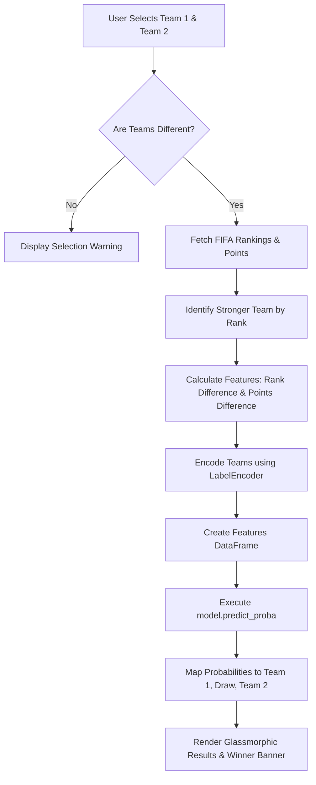
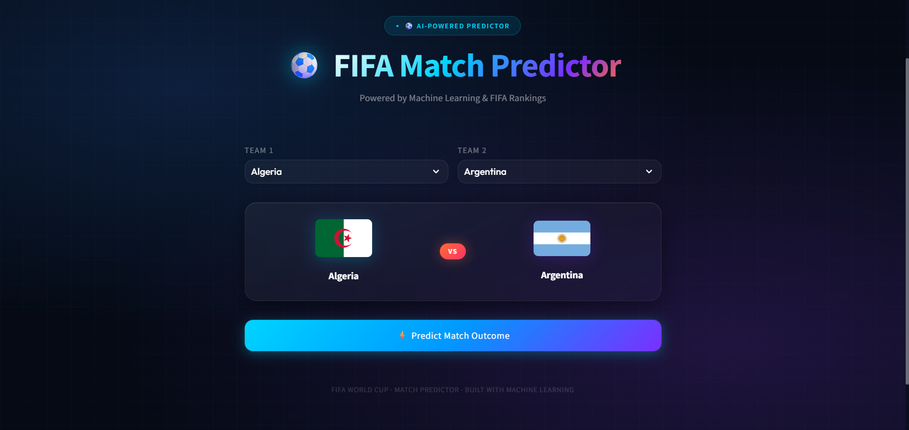
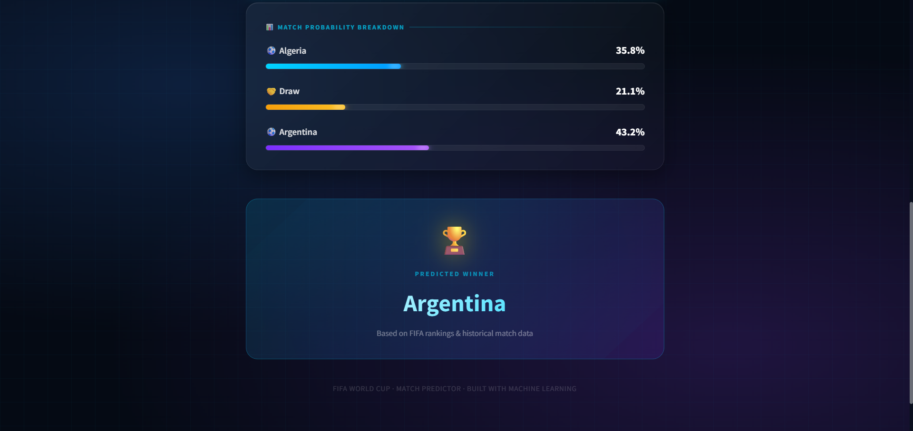

# ⚽ FIFA World Cup Match Winner Predictor

An AI-powered web application that predicts the outcome of a football match between two qualified FIFA World Cup teams using historical match statistics and official FIFA rankings. Featuring a modern, high-fidelity glassmorphic user interface.

---

## 🚀 Project Overview

Predicting sports matchups is highly complex due to the dynamic nature of team performance. This application uses a **Random Forest Classifier** trained on historical FIFA World Cup match results spanning from 1930 to 2022, integrated with historical FIFA team rankings, to calculate the probabilities of three distinct outcomes:

- **Team 1 Win**
- **Draw**
- **Team 2 Win**

---

## 🎨 Interactive User Interface

The application features a modern web experience:

- **Glassmorphic Cards**: Sleek UI modules designed with custom CSS styling, offering a premium dark-themed interface.
- **Dynamic Team Flags**: High-quality country flags fetched dynamically from [FlagCDN](https://flagcdn.com/) based on the selected match.
- **Match Probability Breakdown**: Visual progress bars showing the color-coded probability distribution for Team 1 Win (Blue), Draw (Amber), and Team 2 Win (Purple).
- **Automated Neutral-Ground Modeling**: Eliminates home-field bias to evaluate both teams objectively.

---

## 📊 Features & System Flow

The workflow of the application from user selection to model inference is visualized below:



---

## 🧠 Machine Learning Pipeline

### 1. Data Engineering & Features

The model trains on features derived from `all-world-cup-matches.csv`:

- **home_encoded** / **away_encoded**: Integer encodings of team names using a pre-fitted `LabelEncoder`.
- **win_rate_diff**: Difference in historical win rates between Team 1 and Team 2.
- **avg_goals_diff**: Difference in historical average goals scored per match.
- **is_home_host** / **is_away_host**: Binary indicators for host team advantage.

### 2. Model Configuration

A **Random Forest Classifier** is chosen for its robust performance against multi-collinearity and ability to capture non-linear relationships:

- `n_estimators`: 300
- `max_depth`: 12
- `random_state`: 42

### 3. Model Performance

Evaluated on a 20% test partition, the model achieves a test accuracy of **~51%** for exact three-class classification (Win/Draw/Loss):

```text
              precision    recall  f1-score   support

    AwayWin       0.45      0.23      0.31        39
       Draw       0.21      0.08      0.12        38
    HomeWin       0.55      0.86      0.67        78

   accuracy                           0.51       155
  macro avg       0.41      0.39      0.36       155
weighted avg       0.44      0.51      0.44       155
```

> [!NOTE]
> Predicting exact draw scenarios in international football is notoriously challenging, leading to lower recall on Draw classifications, while predicting wins yields higher precision and recall due to historical trends.

---

## 📂 Repository Structure

```text
├── assets/                    # UI Screenshots
│   ├── ss1.png                # Main Selection Interface
│   └── ss2.png                # Prediction Probabilities
├── FIFA.ipynb                 # Jupyter Notebook (EDA, training, validation)
├── app.py                     # Main Streamlit web application
├── requirements.txt           # Project package dependencies
├── fifa_match_model.pkl       # Trained Random Forest model
├── team_encoder.pkl           # Pre-fitted team LabelEncoder
├── result_encoder.pkl         # Pre-fitted result LabelEncoder
├── team_stats.pkl             # Pre-calculated team historical statistics
├── all-world-cup-matches.csv  # Comprehensive historical World Cup match records
└── README.md                  # Project documentation
```

---

## 🛠️ Local Development & Setup

### Prerequisites

- Python 3.8 or higher installed on your system.

### Steps

1. **Clone the Repository**:

   ```bash
   git clone https://github.com/Aniruddhasain7/FIFA-World-Cup-Match-Winner-Predictor.git
   cd FIFA-World-Cup-Match-Winner-Predictor
   ```

2. **Set Up a Virtual Environment** (Recommended):

   ```bash
   python -m venv venv
   # On Windows:
   venv\Scripts\activate
   # On macOS/Linux:
   source venv/bin/activate
   ```

3. **Install Dependencies**:

   ```bash
   pip install -r requirements.txt
   ```

4. **Launch the Streamlit Web App**:

   ```bash
   streamlit run app.py
   ```

5. Open your web browser and navigate to `http://localhost:8501`.

---

## 📸 Application Preview

### 📍 Main Interface



### 📊 Prediction Result


